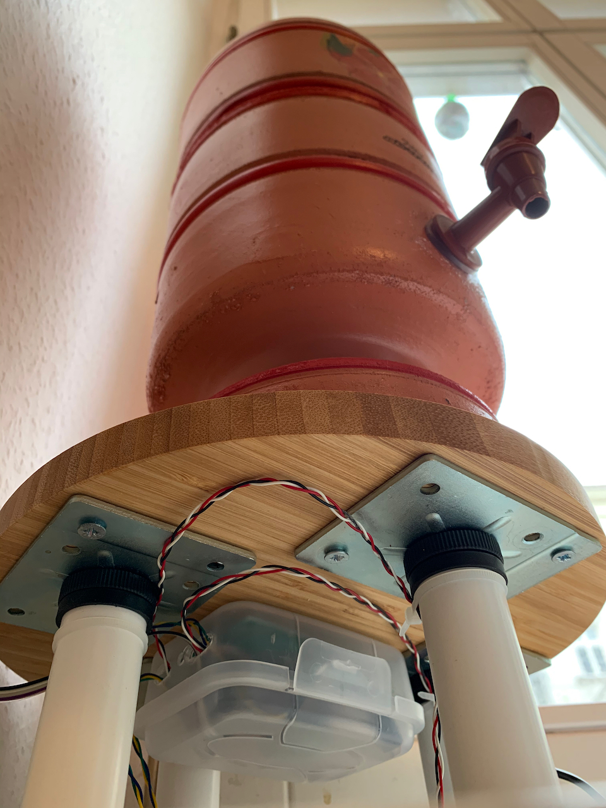

# water-filter-sensor
A smart(er) ceramic water filter for my kitchen. This is the second version. [Here](./v1) you can see the first attempt.

## Concept
We use a [ceramic water filter](https://en.wikipedia.org/wiki/Ceramic_water_filter) at home for our drinking water and ice-making. Normally we try to keep it full, so there's always about 2L available at any time. However to be sure we haven't over-filled, we have to remove the top section to see how much is left in the bottom. Obviously, this minor effort is totally unacceptable, so I built a sensor system to tell us how full the tank is.


Because i'm going totally overboard, it's also WiFi connected, remotely monitored and remotely configurable. Remote config/monitoring is done using my [household data logger](https://github.com/skhg/household-data-logger) project.


## Overview
The water filter now sits on top of a circular wooden board, with adjustable legs I found in a waste bin at IKEA. Each leg has a HX-711 compatible load sensor glued to the bottom. Under the board, there's a plastic box to house the electronics. A longer ribbon cable extends up to eye level where a tiny OLED display shows the estimated fill percentage.


## Materials required
Electronics

* 1 [NodeMCU v3 ESP8266](https://www.amazon.de/-/en/gp/product/B074Q2WM1Y/ref=ppx_yo_dt_b_search_asin_title?ie=UTF8&psc=1)
* 1 HX-711 compatible [load sensor](https://www.amazon.de/gp/product/B075KKH416/ref=ppx_yo_dt_b_asin_title_o03__o00_s00?ie=UTF8&psc=1)
* 1 [OLED Screen](https://www.amazon.de/-/en/gp/product/B01L9GC470/ref=ppx_yo_dt_b_search_asin_title?ie=UTF8&psc=1)
* 1 set of 4 [load cells](https://www.amazon.de/-/en/Weissazi-Personal-Scales-Resistance-Measuring/dp/B07QB2DWMQ/ref=sr_1_16?dchild=1&keywords=arduino+ladungssensor&qid=1587932332&sr=8-16) - I actually got mine from a broken bathroom scales.
* [Ribbon cable](https://www.amazon.de/gp/product/B076CLY8NH/ref=oh_aui_detailpage_o00_s00?ie=UTF8&psc=1)
* [Jumper pin connectors](https://www.amazon.de/gp/product/B01MRSUEHD/ref=oh_aui_detailpage_o01_s00?ie=UTF8&psc=1)

Other:

  * Soldering iron
  * 3rd hand
  * Bamboo board
  * Adjustable legs

## Connecting the load cells

Normally, load cells come with matching wire colours. Unfortunately the ones I scavenged from the old bathroom scale came with different 2 different sets of wire colours, so I had to manually work out which was which.


Eventually I found [this diagram](http://blog.medien.ifi.lmu.de/swh/2018/09/10/hx711-how-to-measure-incorrectly/), and manually labelled the wires to match my own:


And got it wired up the same way...


Circuit diagram of the same thing, with the real world wire colours.


## Construction

The 4 sensors (should) evenly distribute the weight between each other. The [flexing](https://en.wikipedia.org/wiki/Load_cell) of the sensor as weight is applied is detected and converted to a load reading.

The load cells need a little space between themselves and the legs I used, so I glued some cork blocks in between, to allow the sensor space to flex.

Everything comes together in a little plastic box to make it a bit more protected from any nearby water splashes. 



The screen is wedged inside the cap of an old moisturiser jar, just like I used for the [Raspberry Pi killswitch](https://github.com/skhg/raspberrypi-killswitch). These little plastic caps are really versatile for small projects. Since I didn't have any proper tools to cut a hole, I drew a rectangle on the front and melted a hole through it with my soldering iron. Probably toxic and not the best idea.
 


## WiFi connection

### Calibration
For calibration, we need to know what reading the load sensor gives when the tank is empty, and when it's full. Then we can simply get the current reading and work out a percentage of the range. Normally, calibration would mean plugging the board into a laptop over USB, and uploading a new version of the `.ino` sketch with updated high/low values.

So instead, I use a `GET` endpoint on my [household data logger](https://github.com/skhg/household-data-logger) project, to return the current calibration values over HTTP. The filter looks them up automatically so they can be changed at any time. The message received from the server looks like:

```json
{
    "fullLevel" : 121000,
    "emptyLevel" : 117000
}
```

and the filter uses this to reset its own default values each time an update is received.

### Logging
The board also sends back it's current load level to the logger approximately every 2 seconds. This is also done using JSON over HTTP in a format that looks like

```json
{
    "load" : 1234.56,
    "fillPercentage" : 92.24
}
```

I record this in a time-series database and use it to create the Grafana dashboard shown at the top.

## Code
See the full Arduino C++ code in [water-filter-sensor.ino](water-filter-sensor.ino). 

Dependencies:
 * [movingAvg](https://github.com/JChristensen/movingAvg)
 * [Q2HX711](https://github.com/queuetue/Q2-HX711-Arduino-Library)
 * [home_wifi](https://github.com/skhg/home_wifi) configuration
 * [ArduinoJson](https://arduinojson.org/)
 * [ESP8266WiFi](https://github.com/esp8266/Arduino/tree/master/libraries/ESP8266WiFi)
 * [Adafruit_GFX](https://github.com/adafruit/Adafruit-GFX-Library)
 * [Adafruit_SSD1306](https://github.com/adafruit/Adafruit_SSD1306)

## Circuit


The underside of this has the mounting pins for the Arduino board, but I forgot to take a photo.


This can also be viewed in the [Fritzing](http://fritzing.org/) software using the [water_filter_board.fzz](./docs/water_filter_board.fzz) file. 

## References
These tutorials proved useful during the project

* [Soldering Tutorial for Beginners: Five Easy Steps](https://www.youtube.com/watch?v=Qps9woUGkvI)
* [How to Remove Solder](https://www.youtube.com/watch?v=-lnRf2biz50)
* [HX711 Load Cell Amplifier Interface with Arduino](https://www.hackster.io/MOHAN_CHANDALURU/hx711-load-cell-amplifier-interface-with-arduino-fa47f3)
* [Load Cell Amplifier HX711 Breakout Hookup Guide](https://learn.sparkfun.com/tutorials/load-cell-amplifier-hx711-breakout-hookup-guide/all)
