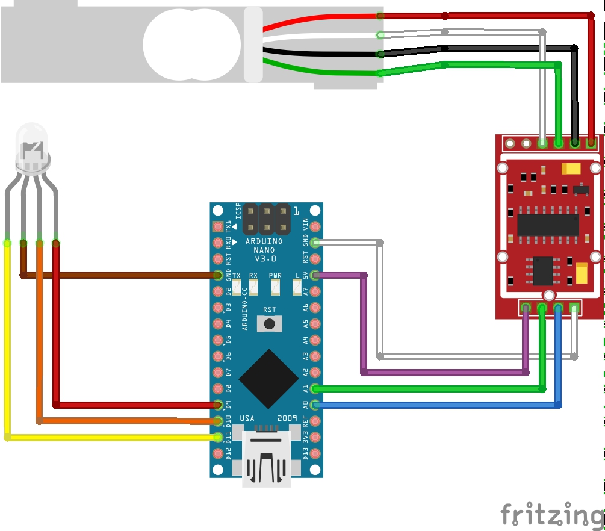

# water-filter-sensor
An indicator light to show the water fill level within a ceramic water filter

## Concept
We use a [ceramic water filter](https://en.wikipedia.org/wiki/Ceramic_water_filter) at home for our drinking water and ice-making. Normally we try to keep it full, so there's always about 2L available at any time. However to be sure we haven't over-filled, we have to remove the top section to see how much is left in the bottom. Obviously, this minor effort is totally unacceptable, so I built a sensor system to tell us how full the tank is.

PHOTO OF THE FINISHED THING HERE

## Overview
The water filter now sits on top of a mounting frame, under which there is a HX-711 compatible weight sensor. Alongside the base of the filter, an RGB LED displays different colours to indicate fill level or warning states.

DIAGRAM OF THE SYSTEM HERE

## Materials required
Electronics

* 1 [Arduino nano](https://www.amazon.de/gp/product/B01C9J7NGS/ref=ppx_yo_dt_b_asin_title_o02__o00_s00?ie=UTF8&psc=1)
* 1 HX-711 compatible [load sensor](https://www.amazon.de/gp/product/B075KKH416/ref=ppx_yo_dt_b_asin_title_o03__o00_s00?ie=UTF8&psc=1)
* 1 [RGB LED](https://www.conrad.de/de/makerfactory-led-modul-vma307-passend-fuer-arduino-boards-arduino-arduino-uno-fayaduino-freeduino-seeeduino-see-1612767.html)
* [Ribbon cable](https://www.amazon.de/gp/product/B076CLY8NH/ref=oh_aui_detailpage_o00_s00?ie=UTF8&psc=1)
* [Jumper pin connectors](https://www.amazon.de/gp/product/B01MRSUEHD/ref=oh_aui_detailpage_o01_s00?ie=UTF8&psc=1)
* 2 [mini breadboards](https://www.amazon.de/gp/product/B01M9CHKO4/ref=oh_aui_detailpage_o01_s00?ie=UTF8&psc=1)

Other:

  * Soldering iron
  * 3rd hand
  * Small screws (15mm)
  * Small bolts (35mm and 40mm)
  * Bamboo boards
  * Various wooden parts
  * Drill and assorted bits
  * Various small pliers, screwdriver, common tools

## Construction

The sensor must be mounted between two plates in order to work. The [flexing](https://en.wikipedia.org/wiki/Load_cell) of the sensor as weight is applied is detected and converted to a weight reading. I built this out of 2 small bamboo chopping boards, which are light and strong. The rest of the wooden pieces I bought at [Bauhaus](https://www.bauhaus.info/)

### Soldering the HX-711
Many HX-711 sensors come in packs with a board and loose pins. I had never soldered anything except a broken [George Foreman](https://en.wikipedia.org/wiki/George_Foreman_Grill) before this project so it was quite an experience to learn how to do this. Fortunately YouTube is full of tutorial videos. References at the end.

### Lower board

The lower board has four 3cm legs attached to keep it above any water that might collect on the counter. Near the centre it has two drilled holes to support the lower side of the sensor, which sits atop a small wooden block. On one side, a wider beam of wood provides a hinge to support half the filter's weight, and reduce the load on the sensor. This beam has some indentations to allow space for the LED module, and holes to fit in bolts that will hold on the top board.

### Upper board

This board will seat the filter, so on top it has four small wooden blocks to provide alignment for the filter's base. The filter should be aligned centrally so the weight is evenly distributed between the sensor and the supporting beam. Otherwise recalibration would be needed every time the filter is moved. On one side two holes fit the bolts that connect the top board to the other side of the sensor. On the other side is the large hole where the LED will poke through.

On the underside, two mini breadboards hold the Arduino, the HX-711 board, and their connections. They're attached to the board with narrow bolts so their position could be adjusted later. On the side which sits above the support beam, the LED hole has a chunk taken out near it, to allow the module and connecting cables space to fit.

### Mounting

After bolting together the boards and tidying the cables out of the way, the water filter can be sat on top. Nice.

## Code
See the full Arduino C++ code in [water-filter-sensor.ino](water-filter-sensor.ino). 

Dependencies:
 * [movingAvg](https://github.com/JChristensen/movingAvg)
 * [Q2HX711](https://github.com/queuetue/Q2-HX711-Arduino-Library)

## Circuit

This can also be viewed in the [Fritzing](http://fritzing.org/) software using the [water-filter.fzz](water-filter.fzz) file. 

## Calibration

Depending on the tension in the bolts connecting the board, sensor and support beam, the force applied to the sensor may vary quite a lot. It's important to recalibrate the sensor after taking the system apart or changing it's location.

By enabling `DEBUG` mode and viewing the output we can determine what the sensor reads when the tanks are full or empty, and use this to change the parameters defined at the top of [water-filter-sensor.ino](water-filter-sensor.ino).

Debug output also prints static lines which can be viewed in the Arduino [plotter](https://learn.adafruit.com/experimenters-guide-for-metro/circ08-using%20the%20arduino%20serial%20plotter) to show the various limits or trigger levels that have been set. Filling and emptying the tank can easily show how the level varies in the real-time graph.

### Configuration

Many other configuration options are available at the top of [water-filter-sensor.ino](water-filter-sensor.ino) including relative LED brightness, smoothness or accuracy of sensor data, and at what levels you want to get high/low water alerts. 

## References
These tutorials proved useful during the project

* [Soldering Tutorial for Beginners: Five Easy Steps](https://www.youtube.com/watch?v=Qps9woUGkvI)
* [How to Remove Solder](https://www.youtube.com/watch?v=-lnRf2biz50)
* [HX711 Load Cell Amplifier Interface with Arduino](https://www.hackster.io/MOHAN_CHANDALURU/hx711-load-cell-amplifier-interface-with-arduino-fa47f3)
* [Load Cell Amplifier HX711 Breakout Hookup Guide](https://learn.sparkfun.com/tutorials/load-cell-amplifier-hx711-breakout-hookup-guide/all)
